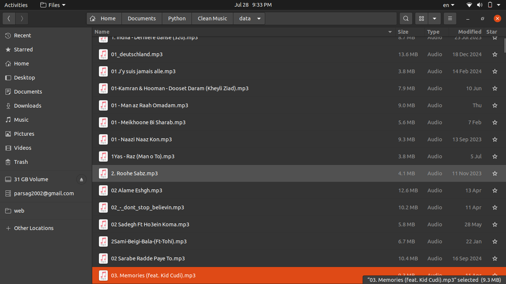
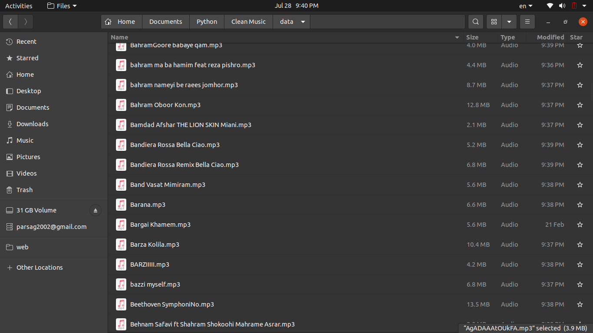

# 🎧 Clean Music – Remove Website Watermarks from Music Files

In **Iran**, many music download websites automatically insert their **website address** into MP3 files as:

- `ID3 tags` (like album, comment, or artist fields)
- File names (like `Artist - SongName - www.sitemusic.ir.mp3`)

This clutter is **annoying**, makes organizing your music hard, and ruins the music library experience on your phone, player, or media app.

This project provides a **Python-based utility** to:

✅ Clean up ID3 tags (`album`, `artist`, `title`, `comment`)  
✅ Remove all **site URLs**, special characters, numbers from file names  
✅ Keep useful metadata (like `feat.` or `&`)  
✅ Normalize names with clean, human-readable formatting

---

## ✨ Before and After Example

Below you can see an example of **before** and **after** cleaning:

### 🔻 Before Cleaning


### ✅ After Cleaning


---

## 📦 Features

- Remove **website addresses** like `www.sitemusic.com`, `.ir`, etc.
- Strip unnecessary symbols and numbers from tags and filenames
- Preserve useful punctuation like **`&`** and **`feat.`**
- Supports batch processing with progress bar (`tqdm`)
- Clean up **ID3 v1 and v2** tags

---

## 🧪 Example Use

Just run:

```bash
python main.py
